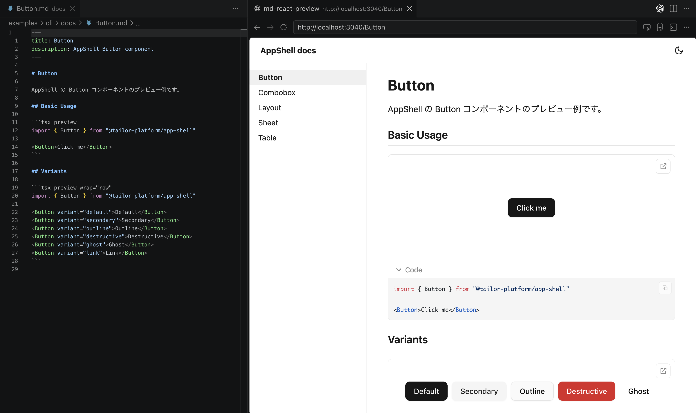

# md-react-preview

[](https://github.com/IzumiSy/md-react-preview/actions/workflows/ci.yml)

A lightweight toolkit for live-previewing React components directly from Markdown. Write ` ```tsx preview ` fenced blocks and get instant rendered output — powered by Vite.



## Packages

| Package                                                                               | Version                                                                                                                                                               | Description                                                                                           |
| ------------------------------------------------------------------------------------- | ----------------------------------------------------------------------------------------------------- | ----------------------------------------------------------------------------------------------------- |
| [`@izumisy/md-react-preview`](packages/md-react-preview/)                             | [](https://www.npmjs.com/package/@izumisy/md-react-preview)                                             | CLI & programmatic API — run a standalone preview server with `mrp dev` / `mrp build`                 |
| [`@izumisy/vite-plugin-react-preview`](packages/vite-plugin-react-preview/)           | [](https://www.npmjs.com/package/@izumisy/vite-plugin-react-preview)                           | Vite plugin & utilities — preview block parsing, iframe rendering, standalone preview page generation |
| [`@izumisy/vitepress-plugin-react-preview`](packages/vitepress-plugin-react-preview/) | [](https://www.npmjs.com/package/@izumisy/vitepress-plugin-react-preview)                 | VitePress plugin — live React component previews inside a VitePress site                              |

## Examples

| Example                                    | Description                                                          |
| ------------------------------------------ | -------------------------------------------------------------------- |
| [`example-cli`](examples/cli/)             | Standalone preview server using the `@izumisy/md-react-preview` CLI  |
| [`example-vitepress`](examples/vitepress/) | VitePress integration with `@izumisy/vitepress-plugin-react-preview` |

## Quick Start

```bash
pnpm add -D @izumisy/md-react-preview

npx mrp dev      # dev server (port 3040)
npx mrp build    # static build
```

See the [`@izumisy/md-react-preview` README](packages/md-react-preview/) for configuration and usage details.

## License

MIT
